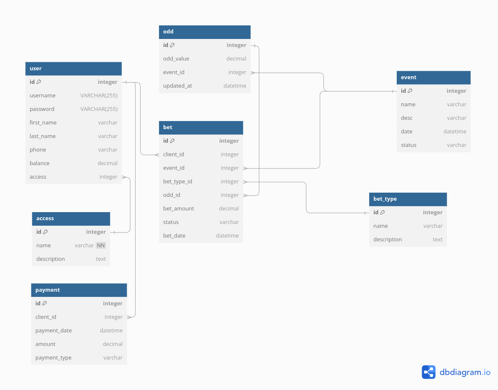

# MaiBets

# TODO
- [x] Добавить в миграции создание таблицы
- [x] При добавлении ивентов рандомно генерируются кефы
- [x] Добавление ставки
- [ ] При получении награды учитывать множитель ставки
- [x] Гет запросы на получение всех ставок пользователя
- [ ] Гет запросы на получение всех ивентов
- [ ] На стороне базы данных необходимо определить представления, триггеры, функции и хранимые процедуры,
    - [ ] Триггер на закрытие ивента, когда настает его время
    - [ ] Триггер на закрытие ставки, когда ивент закрывается и рассет стаки
    - [ ] Триггер на удаление кефов, когда ивент закрывается
- [ ] Добавление ивентов (рандом длительность)
- [ ] Добавить документацию для API

# Future todo
- [x] Добавить админа в миграции
- [ ] Добавить проверку на админа в мидлваре?
- [ ] Добавлять события можно только админ

---

## DB model


## Api docs (swagger)

Для получение документации нужно запустить контейнер приложения
```bash
docker-compose up --build
```
И перейти по: http://localhost:8080/swagger/index.htm